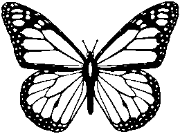
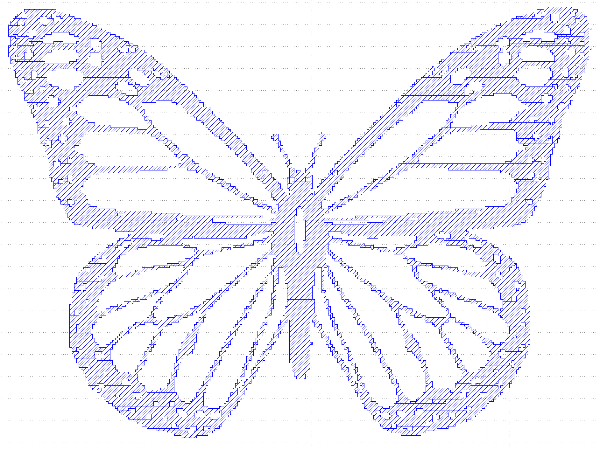

# bmpToGDS

bmpToGDS is a simple converter from .bmp files to gdspy layouts with controllable scaling.

## Installation

Download the package or clone the repository, and then install with:

```bash
python setup.py install
```

### Prerequisites

bmpToGDS uses numpy, PIL, and gdspy

### Basic Usage

This demo converts the following bmp into a gds layout.



```python
import bmpToGDS as conv
import gdspy
    """
    bmpToGDS has the following arguments
    Args:
        bmp: A string refering to the file location of the BMP file
        width: Physical Width (X) of the bmp image specified in micrometers
        height: Physical Height (Y) of the bmp image 
        layer: Layer the bmp file should be placed in the GDS file
        datatype: datatype of the layer 
        black: Pixel value that refers to black, all other pixel values are rendered white
    Returns: 
        gdspy polygon
    """
butterfly=conv.bmpToGDS("butterfly.bmp", 1.34,1,0,0,black=0)
#butterfly is a gdspy polygonset, to write to GDSfile we use gdspy as follows:
gdspy.current_library=gdspy.GdsLibrary()
cell=gdspy.Cell("butterfly")
cell.add(butterfly)
gdspy.write_gds("Butterfly.gds") 
```
The output butterfly as seen in the GDS viewer looks as follows: 



For more details on using gdspy on this see the gdspy documentation: https://github.com/heitzmann/gdspy

The code example shown above can be found as a Jupyter notebook in the Demos folder.

## Authors

Trezitorul

## License

This project is licensed under the MIT License